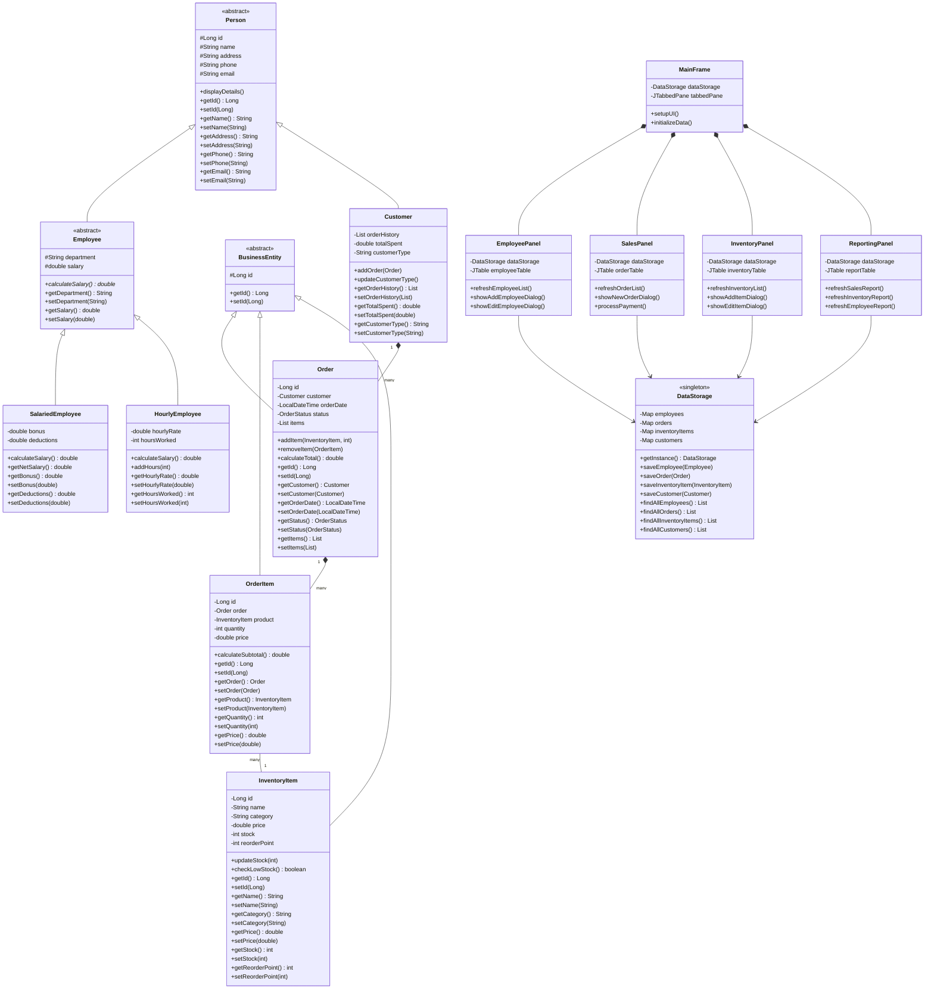
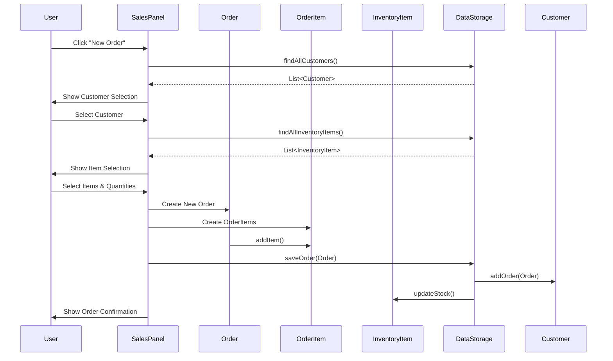
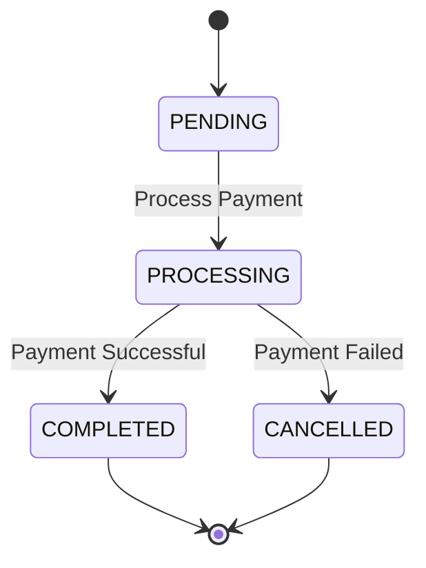
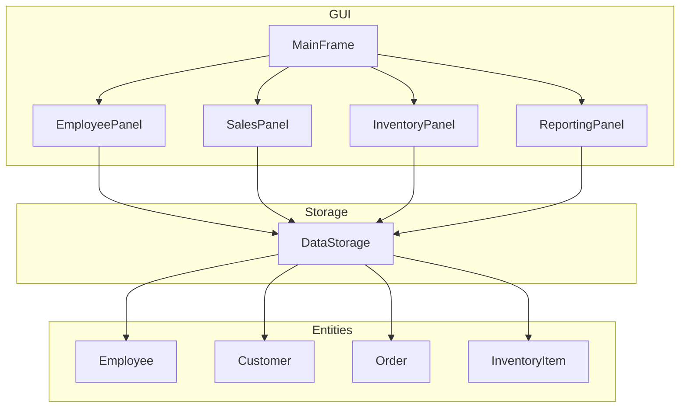
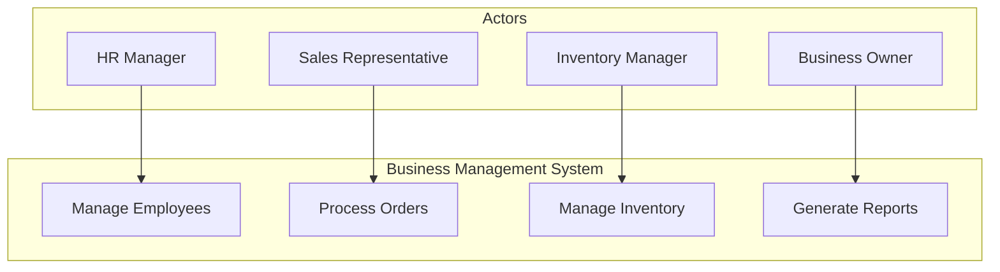

# UML Diagrams

## Class Diagram

```mermaid
classDiagram
    %% Abstract Classes
    class Person {
        <<abstract>>
        #Long id
        #String name
        #String address
        #String phone
        #String email
        +displayDetails()
        +getId() Long
        +setId(Long)
        +getName() String
        +setName(String)
        +getAddress() String
        +setAddress(String)
        +getPhone() String
        +setPhone(String)
        +getEmail() String
        +setEmail(String)
    }

    class Employee {
        <<abstract>>
        #String department
        #double salary
        +calculateSalary()* double
        +getDepartment() String
        +setDepartment(String)
        +getSalary() double
        +setSalary(double)
    }

    class BusinessEntity {
        <<abstract>>
        #Long id
        +getId() Long
        +setId(Long)
    }

    %% Concrete Classes
    class SalariedEmployee {
        -double bonus
        -double deductions
        +calculateSalary() double
        +getNetSalary() double
        +getBonus() double
        +setBonus(double)
        +getDeductions() double
        +setDeductions(double)
    }

    class HourlyEmployee {
        -double hourlyRate
        -int hoursWorked
        +calculateSalary() double
        +addHours(int)
        +getHourlyRate() double
        +setHourlyRate(double)
        +getHoursWorked() int
        +setHoursWorked(int)
    }

    class Customer {
        -List<Order> orderHistory
        -double totalSpent
        -String customerType
        +addOrder(Order)
        +updateCustomerType()
        +getOrderHistory() List<Order>
        +setOrderHistory(List<Order>)
        +getTotalSpent() double
        +setTotalSpent(double)
        +getCustomerType() String
        +setCustomerType(String)
    }

    class Order {
        -Long id
        -Customer customer
        -LocalDateTime orderDate
        -OrderStatus status
        -List<OrderItem> items
        +addItem(InventoryItem, int)
        +removeItem(OrderItem)
        +calculateTotal() double
        +getId() Long
        +setId(Long)
        +getCustomer() Customer
        +setCustomer(Customer)
        +getOrderDate() LocalDateTime
        +setOrderDate(LocalDateTime)
        +getStatus() OrderStatus
        +setStatus(OrderStatus)
        +getItems() List<OrderItem>
        +setItems(List<OrderItem>)
    }

    class OrderItem {
        -Long id
        -Order order
        -InventoryItem product
        -int quantity
        -double price
        +calculateSubtotal() double
        +getId() Long
        +setId(Long)
        +getOrder() Order
        +setOrder(Order)
        +getProduct() InventoryItem
        +setProduct(InventoryItem)
        +getQuantity() int
        +setQuantity(int)
        +getPrice() double
        +setPrice(double)
    }

    class InventoryItem {
        -Long id
        -String name
        -String category
        -double price
        -int stock
        -int reorderPoint
        +updateStock(int)
        +checkLowStock() boolean
        +getId() Long
        +setId(Long)
        +getName() String
        +setName(String)
        +getCategory() String
        +setCategory(String)
        +getPrice() double
        +setPrice(double)
        +getStock() int
        +setStock(int)
        +getReorderPoint() int
        +setReorderPoint(int)
    }

    %% Storage
    class DataStorage {
        <<singleton>>
        -Map<Long, Employee> employees
        -Map<Long, Order> orders
        -Map<Long, InventoryItem> inventoryItems
        -Map<Long, Customer> customers
        +getInstance() DataStorage
        +saveEmployee(Employee)
        +saveOrder(Order)
        +saveInventoryItem(InventoryItem)
        +saveCustomer(Customer)
        +findAllEmployees() List<Employee>
        +findAllOrders() List<Order>
        +findAllInventoryItems() List<InventoryItem>
        +findAllCustomers() List<Customer>
    }

    %% GUI Components
    class MainFrame {
        -DataStorage dataStorage
        -JTabbedPane tabbedPane
        +setupUI()
        +initializeData()
    }

    class EmployeePanel {
        -DataStorage dataStorage
        -JTable employeeTable
        +refreshEmployeeList()
        +showAddEmployeeDialog()
        +showEditEmployeeDialog()
    }

    class SalesPanel {
        -DataStorage dataStorage
        -JTable orderTable
        +refreshOrderList()
        +showNewOrderDialog()
        +processPayment()
    }

    class InventoryPanel {
        -DataStorage dataStorage
        -JTable inventoryTable
        +refreshInventoryList()
        +showAddItemDialog()
        +showEditItemDialog()
    }

    class ReportingPanel {
        -DataStorage dataStorage
        -JTable reportTable
        +refreshSalesReport()
        +refreshInventoryReport()
        +refreshEmployeeReport()
    }

    %% Relationships
    Person <|-- Employee
    Employee <|-- SalariedEmployee
    Employee <|-- HourlyEmployee
    Person <|-- Customer
    BusinessEntity <|-- Order
    BusinessEntity <|-- OrderItem
    BusinessEntity <|-- InventoryItem
    Order "1" *-- "many" OrderItem
    OrderItem "many" -- "1" InventoryItem
    Customer "1" *-- "many" Order
    MainFrame *-- EmployeePanel
    MainFrame *-- SalesPanel
    MainFrame *-- InventoryPanel
    MainFrame *-- ReportingPanel
    EmployeePanel --> DataStorage
    SalesPanel --> DataStorage
    InventoryPanel --> DataStorage
    ReportingPanel --> DataStorage
```

## Sequence Diagram for Creating a New Order

```mermaid
sequenceDiagram
    participant User
    participant SalesPanel
    participant Order
    participant OrderItem
    participant InventoryItem
    participant DataStorage
    participant Customer

    User->>SalesPanel: Click "New Order"
    SalesPanel->>DataStorage: findAllCustomers()
    DataStorage-->>SalesPanel: List<Customer>
    SalesPanel->>User: Show Customer Selection
    User->>SalesPanel: Select Customer
    SalesPanel->>DataStorage: findAllInventoryItems()
    DataStorage-->>SalesPanel: List<InventoryItem>
    SalesPanel->>User: Show Item Selection
    User->>SalesPanel: Select Items & Quantities
    SalesPanel->>Order: Create New Order
    SalesPanel->>OrderItem: Create OrderItems
    Order->>OrderItem: addItem()
    SalesPanel->>DataStorage: saveOrder(Order)
    DataStorage->>Customer: addOrder(Order)
    DataStorage->>InventoryItem: updateStock()
    SalesPanel->>User: Show Order Confirmation
```

## State Diagram for Order Status

```mermaid
stateDiagram-v2
    [*] --> PENDING
    PENDING --> PROCESSING: Process Payment
    PROCESSING --> COMPLETED: Payment Successful
    PROCESSING --> CANCELLED: Payment Failed
    COMPLETED --> [*]
    CANCELLED --> [*]
```

## Component Diagram

```mermaid
graph TB
    subgraph GUI
        MF[MainFrame]
        EP[EmployeePanel]
        SP[SalesPanel]
        IP[InventoryPanel]
        RP[ReportingPanel]
    end

    subgraph Storage
        DS[DataStorage]
    end

    subgraph Entities
        E[Employee]
        C[Customer]
        O[Order]
        I[InventoryItem]
    end

    MF --> EP
    MF --> SP
    MF --> IP
    MF --> RP

    EP --> DS
    SP --> DS
    IP --> DS
    RP --> DS

    DS --> E
    DS --> C
    DS --> O
    DS --> I
```

## Use Case Diagram

```mermaid
graph TB
    subgraph Business Management System
        UC1[Manage Employees]
        UC2[Process Orders]
        UC3[Manage Inventory]
        UC4[Generate Reports]
    end

    subgraph Actors
        A1[HR Manager]
        A2[Sales Representative]
        A3[Inventory Manager]
        A4[Business Owner]
    end

    A1 --> UC1
    A2 --> UC2
    A3 --> UC3
    A4 --> UC4
``` 